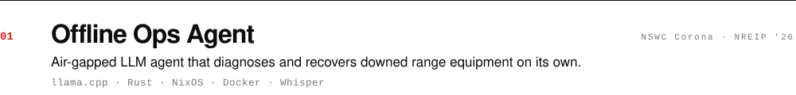
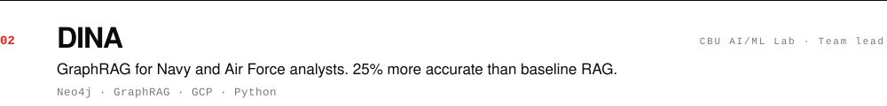
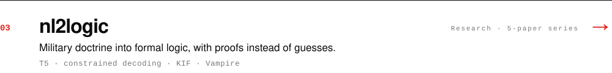
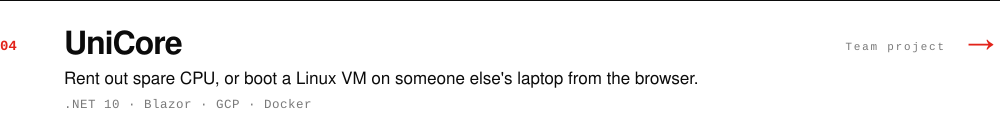
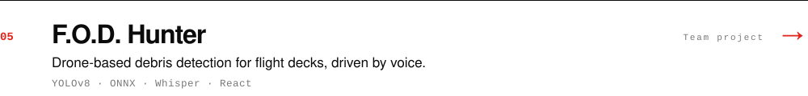
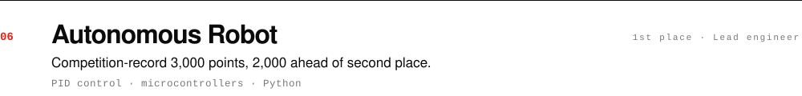

<!-- Artwork in assets/ is generated by scripts/build.py. Edit the data there, not the SVGs. -->

<picture><source media="(prefers-color-scheme: dark)" srcset="assets/hero-dark.svg"></picture>

  <a href="https://brandon-magana.web.app"><b>Resume</b></a> &nbsp;·&nbsp;
  <a href="https://www.linkedin.com/in/li-brandon-magana/"><b>LinkedIn</b></a> &nbsp;·&nbsp;
  <a href="mailto:magana.brandon05@gmail.com"><b>Email</b></a>

**Now:** M.S. coursework in machine and deep learning, and a research series on turning natural language into verifiable logic. Headed to NSWC Dahlgren as a DoD SMART Scholar.

### Selected work

<picture><source media="(prefers-color-scheme: dark)" srcset="assets/row-agent-dark.svg"></picture>
<picture><source media="(prefers-color-scheme: dark)" srcset="assets/row-dina-dark.svg"></picture>
<a href="https://github.com/ghbrando/nl2logic-research"><picture><source media="(prefers-color-scheme: dark)" srcset="assets/row-nl2logic-dark.svg"></picture></a>
<a href="https://github.com/ghbrando/unicore"><picture><source media="(prefers-color-scheme: dark)" srcset="assets/row-unicore-dark.svg"></picture></a>
<a href="https://github.com/ghbrando/fod_hunter"><picture><source media="(prefers-color-scheme: dark)" srcset="assets/row-fod-dark.svg"></picture></a>
<picture><source media="(prefers-color-scheme: dark)" srcset="assets/row-robot-dark.svg"></picture>

### Toolbox

<b>AI / ML</b> PyTorch · LangChain · LangGraph · LlamaIndex · GraphRAG · OpenCV · YOLO · Whisper &nbsp;·&nbsp; <b>Inference</b> llama.cpp · CUDA · TensorRT · ONNX · OpenVINO &nbsp;·&nbsp; <b>Data</b> Neo4j · PostgreSQL · ChromaDB · Cypher

### Activity

<picture>
  <source media="(prefers-color-scheme: dark)" srcset="https://raw.githubusercontent.com/ghbrando/ghbrando/output/snake-dark.svg">
  
</picture>

Riverside, CA · Open to AI/ML and defense-tech roles
